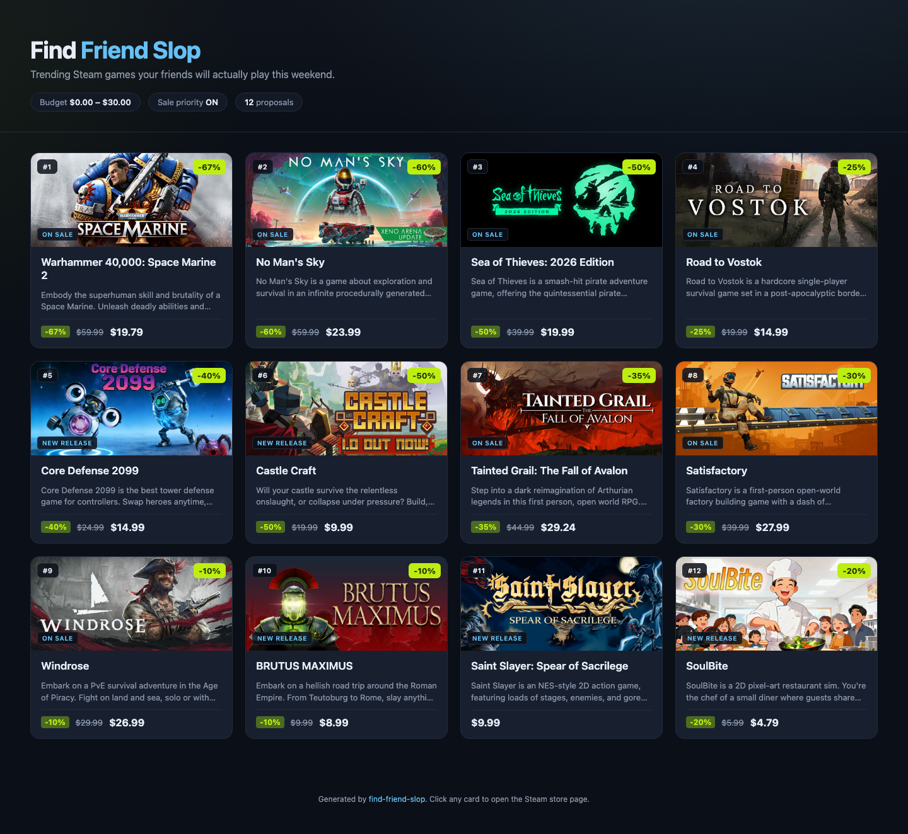

# find-friend-slop

A Claude Code slash-command skill for building a one-click **Steam game proposal page** to send to your friends.

You give it a price range. It pulls trending games from Steam, filters them to your budget, bumps the ones currently on sale, and renders a polished HTML page where every card links straight to the Steam store.



## What it does

1. Pulls trending games from Steam's public `featuredcategories` endpoint (top sellers, specials, new releases).
2. Enriches each candidate with live price/discount data via `appdetails`.
3. **Filters out NSFW / adult-sexual-content titles** using Steam's `content_descriptors` (IDs 1, 3, 4) plus genre and keyword checks (see `is_nsfw()` in `scripts/fetch_games.py`).
4. Filters to the price range you gave it.
5. Ranks the survivors using a weighted sum — **sale 50% / trending 30% / price fit 20%** (tunable in `scripts/fetch_games.py::score_game`).
6. Renders a dark-mode proposal page. Each card links to the Steam store page for that game.

No Steam API key required.

## Install as a Claude Code skill

```bash
# Clone into your skills dir (or anywhere Claude Code can reach)
git clone https://github.com/<your-user>/find-friend-slop ~/.claude/skills/find-friend-slop
```

Invoke from Claude Code with natural language:

- *"find some slop for my friends under $30"*
- *"recommend Steam games between $10 and $40, prioritize sales"*
- *"what should we play tonight, budget $20"*

Claude will parse the price range, run the skill, and hand you back a path to the generated HTML.

## Run manually

```bash
# 1. Fetch + rank trending games in your budget
python3 scripts/fetch_games.py \
  --min 0 --max 30 \
  --prioritize-sales \
  --limit 12 \
  --out out/games.json

# 2. Render the HTML proposal page
python3 scripts/generate_html.py \
  --in out/games.json \
  --out out/proposals.html

# 3. Open it
open out/proposals.html   # macOS
```

### CLI flags

**`scripts/fetch_games.py`**

| Flag | Default | Description |
|------|---------|-------------|
| `--min` | *required* | Minimum price in USD |
| `--max` | *required* | Maximum price in USD |
| `--prioritize-sales` | off | Boost games currently discounted |
| `--limit` | `18` | Max games to return |
| `--out` | `games.json` | Output JSON path |

## Scoring

Each game gets a score between 0 and 1. Higher is better.

```
score = 0.50 · sale_score        # discount % / 100, or 0 if not on sale
      + 0.30 · trend_score       # exp(-rank/40), hotter = closer to 1
      + 0.20 · price_fit_score   # 1.0 at midpoint of range, 0 at edges
```

When `--prioritize-sales` is off, the sale weight (0.50) is redistributed across trending (0.65) and price-fit (0.35). Free-to-play titles get a sale score of 0 — no penalty, no artificial boost.

Tune in `scripts/fetch_games.py::score_game`.

## Project layout

```
find-friend-slop/
├── SKILL.md                  # Claude Code skill manifest
├── scripts/
│   ├── fetch_games.py        # Steam API client + filter + rank + CLI
│   └── generate_html.py      # JSON → polished HTML
├── out/                      # Generated artifacts (git-ignored)
│   ├── games.json
│   └── proposals.html
└── docs/
    └── screenshot.png        # Sample output, shown above
```

## Notes

- Prices are USD (`cc=us`). Change `FEATURED_URL` in `scripts/fetch_games.py` for other regions.
- The fetcher sleeps 0.25s between `appdetails` calls to stay under Steam's ~200-req / 5-min rate limit.
- Free-to-play titles (`price_overview == null`) are treated as $0 and included when your min bound is 0.
